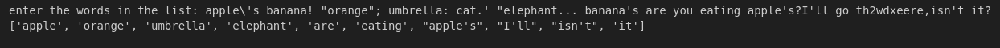
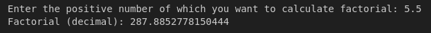
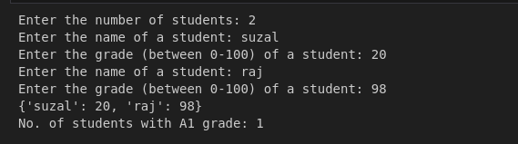
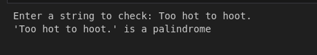
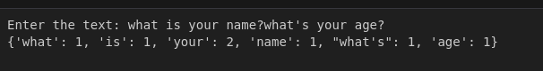
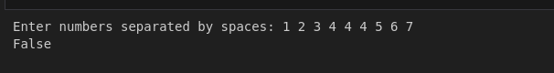
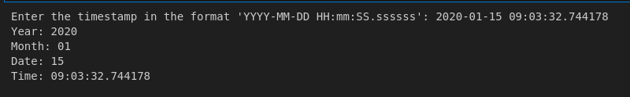

## Intermediate Python Tasks
### 1. words start with vowels

### 2. factorial

### 3. count students with a1 grades

### 4. string palindrome

### 5. word frequency

### 6. different numbers

### 7. time extraction
